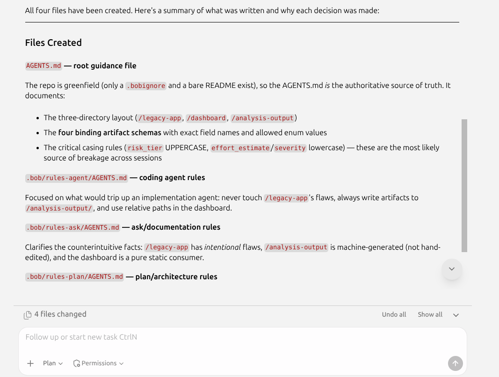
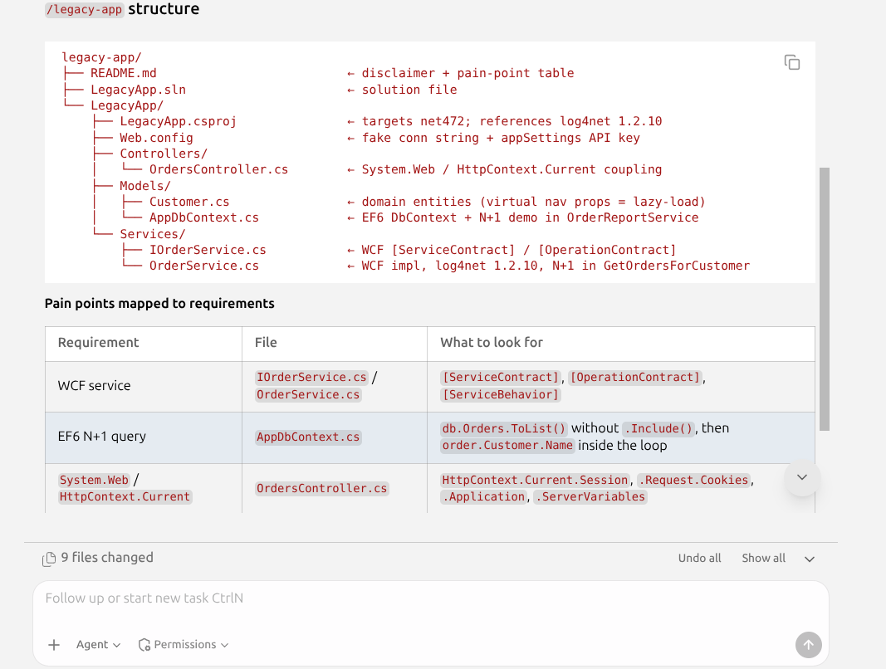
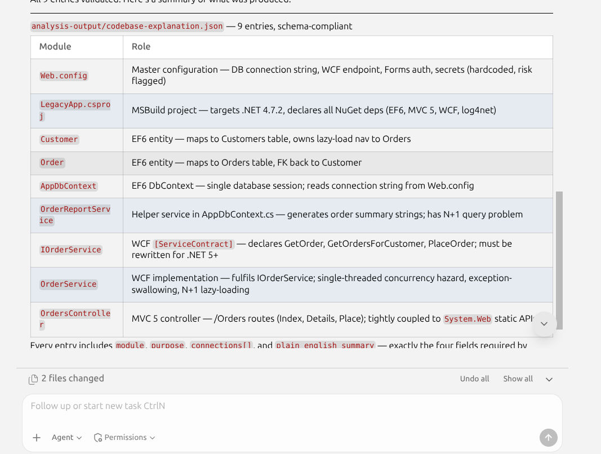
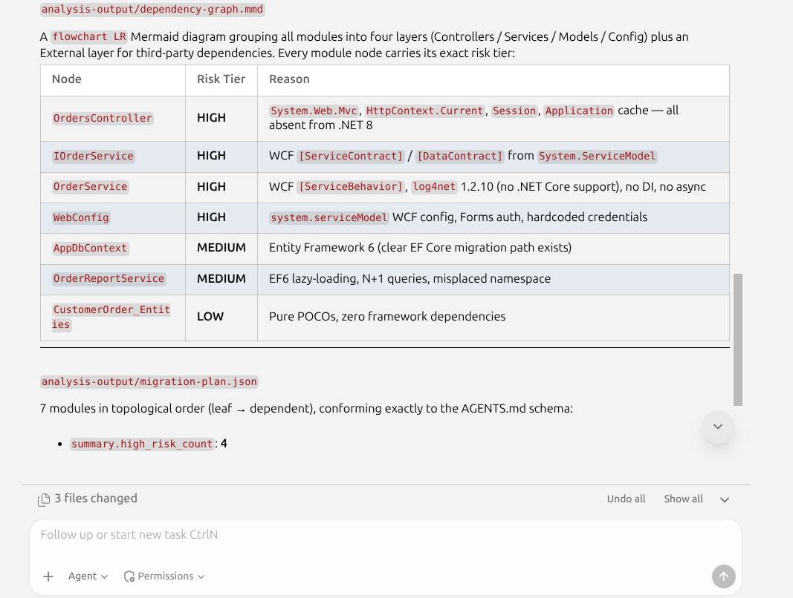
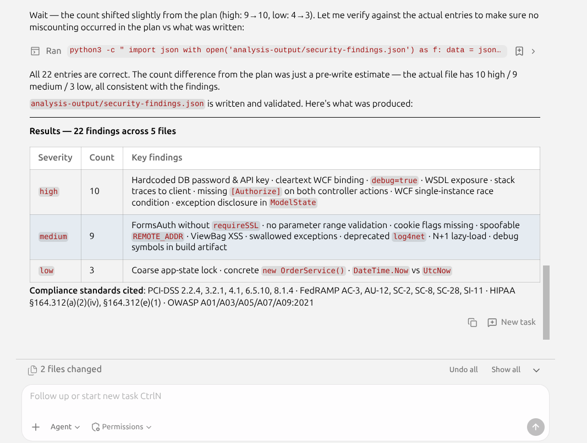
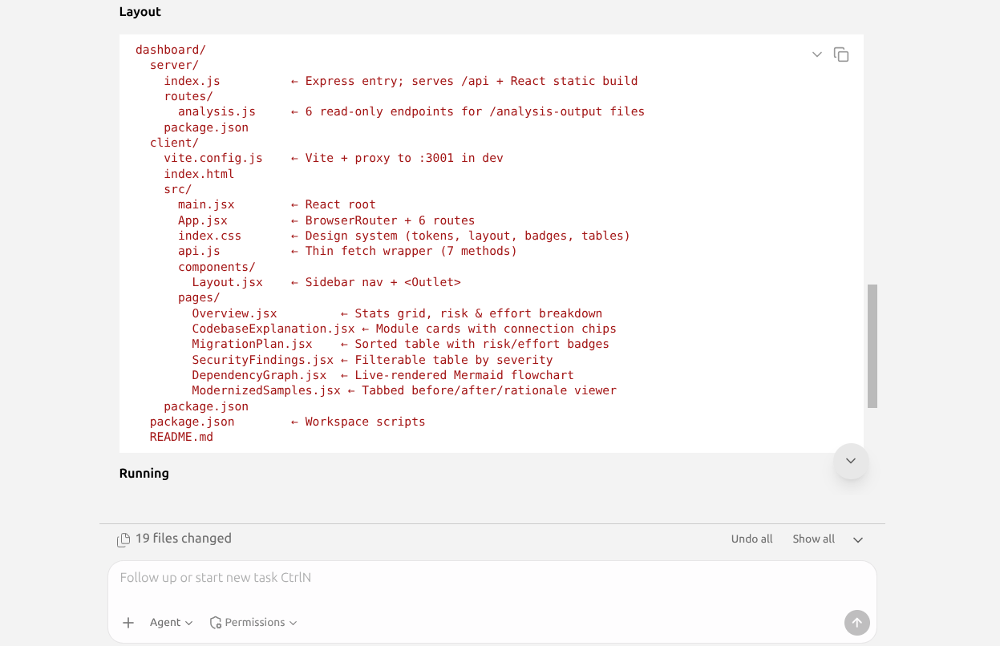
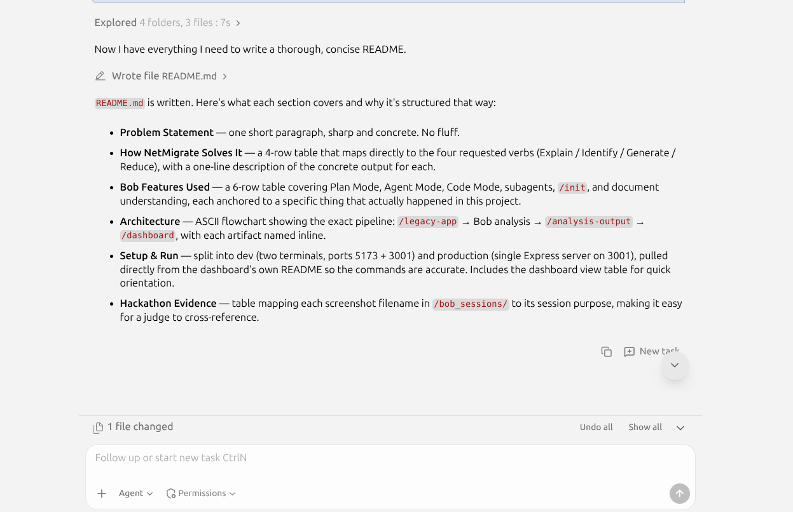
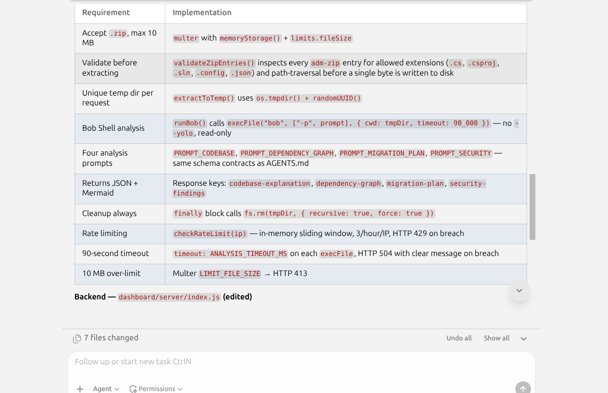

# NetMigrate

> **IBM Bob 2.0 Hackathon** — a legacy .NET modernization accelerator powered by Bob AI.

---

## Problem Statement

Scoping a migration from .NET Framework to modern .NET is **slow, risky, and expensive**.
Teams spend weeks manually reading unfamiliar code, estimating effort, hunting for security
debt, and writing boilerplate replacements — before a single line of production code changes.
One wrong assumption can cascade into months of rework.

---

## How NetMigrate Solves It

NetMigrate uses Bob to automate the four hardest parts of any migration engagement:

| Verb                                     | What NetMigrate does                                                                                                                                                             |
| ---------------------------------------- | -------------------------------------------------------------------------------------------------------------------------------------------------------------------------------- |
| **Explain** existing code                | Reads every module in the legacy app and produces plain-English summaries, connection maps, and a rendered dependency graph — no prior codebase knowledge required.              |
| **Identify** modernization opportunities | Scores each module with a risk tier (LOW / MEDIUM / HIGH), recommended .NET replacement, and effort estimate, then orders them into a safe migration sequence.                   |
| **Generate** updated components          | Produces before-and-after code samples for the three most common migration patterns (synchronous → async, XML config → `appsettings.json`, `WebClient` → `HttpClient`).          |
| **Reduce** migration effort              | Packages all findings in a live dashboard so the whole team can explore the analysis, filter security findings, and review modernized samples — without re-running any analysis. |

---

## Bob Features Used

| Feature                     | How it was used in this project                                                                                                            |
| --------------------------- | ------------------------------------------------------------------------------------------------------------------------------------------ |
| **Plan Mode**               | Drafted analysis plans (`analysis-plan.md`, `codebase-explanation-plan.md`, `security-audit-plan.md`) before any code was written.         |
| **Agent Mode**              | Executed each analysis step end-to-end: reading source files, generating JSON artifacts, scaffolding the dashboard.                        |
| **Code Mode**               | Wrote and iterated on the React + Express dashboard, the API routes, and the modernized code samples.                                      |
| **Subagents**               | Parallelized independent analysis tasks (e.g., security scan while migration plan was being built) to keep each agent context focused.     |
| **`/init` project context** | Bootstrapped `AGENTS.md` with schema contracts and project rules so every subsequent session inherited the same conventions automatically. |
| **Document understanding**  | Parsed the legacy `.config` and `.aspx` files to extract configuration patterns, route structures, and data-access concerns.               |

---

## Architecture

```
/legacy-app  (sample ASP.NET 4.x input)
     │
     ▼
 Bob analysis  (Plan → Agent → Code modes)
     │
     ▼
/analysis-output
  ├── codebase-explanation.json   ← module map & plain-English summaries
  ├── dependency-graph.mmd        ← Mermaid risk-annotated dependency graph
  ├── migration-plan.json         ← risk tiers, effort, migration order
  ├── security-findings.json      ← file-level security issues
  └── modernized-samples/         ← before/after/rationale for 3 patterns
     │
     ▼
/dashboard  (React + Node/Express visualizer)
  reads /analysis-output at a relative path — no configuration needed
```

---

## Setup & Run

**Prerequisites:** Node.js 18+

### Development (two terminals)

```bash
# Terminal 1 — API server on :3000
cd dashboard/server && npm install && npm run dev

# Terminal 2 — React dev server on :5173 (proxies /api to :3000)
cd dashboard/client && npm install && npm run dev
```

Open **http://localhost:5173**

### Production (single server)

```bash
cd dashboard/client && npm install && npm run build
cd dashboard/server && npm install && npm start
```

Open **http://localhost:3000**

### Docker

**Prerequisites:** Docker

```bash
# Build the image (run from repo root)
docker build -f dashboard/server/Dockerfile -t netmigrate-backend .

# Run the container
docker run --rm --env-file ./dashboard/server/.env \
  -p 3000:3000 \
  netmigrate-backend
```

Open **http://localhost:3000**

### Dashboard views

| View             | Route               | Description                                    |
| ---------------- | ------------------- | ---------------------------------------------- |
| Overview         | `/overview`         | Summary stats, risk breakdown, migration order |
| Codebase         | `/codebase`         | Plain-English module explanations              |
| Migration Plan   | `/migration`        | Sortable table with risk/effort badges         |
| Security         | `/security`         | Filterable security findings                   |
| Dependency Graph | `/dependency-graph` | Rendered Mermaid flowchart                     |
| Code Samples     | `/samples`          | Before / After / Rationale tabs                |

---

## Hackathon Evidence

`/bob_sessions/` contains screenshots of every Bob task session used to build this project:

### 1 — Bootstrap project context (`/init` + AGENTS.md setup)


### 2 — Generate the sample legacy .NET app


### 3 — Codebase explanation


### 4 — Dependency graph and migration plan


### 5 — Security and compliance findings


### 6 — Generate modernized code (before and after)
.png)

### 7 — Build the dashboard


### 8 — README and submission polish


### 9 — Bob shell setup for live upload

